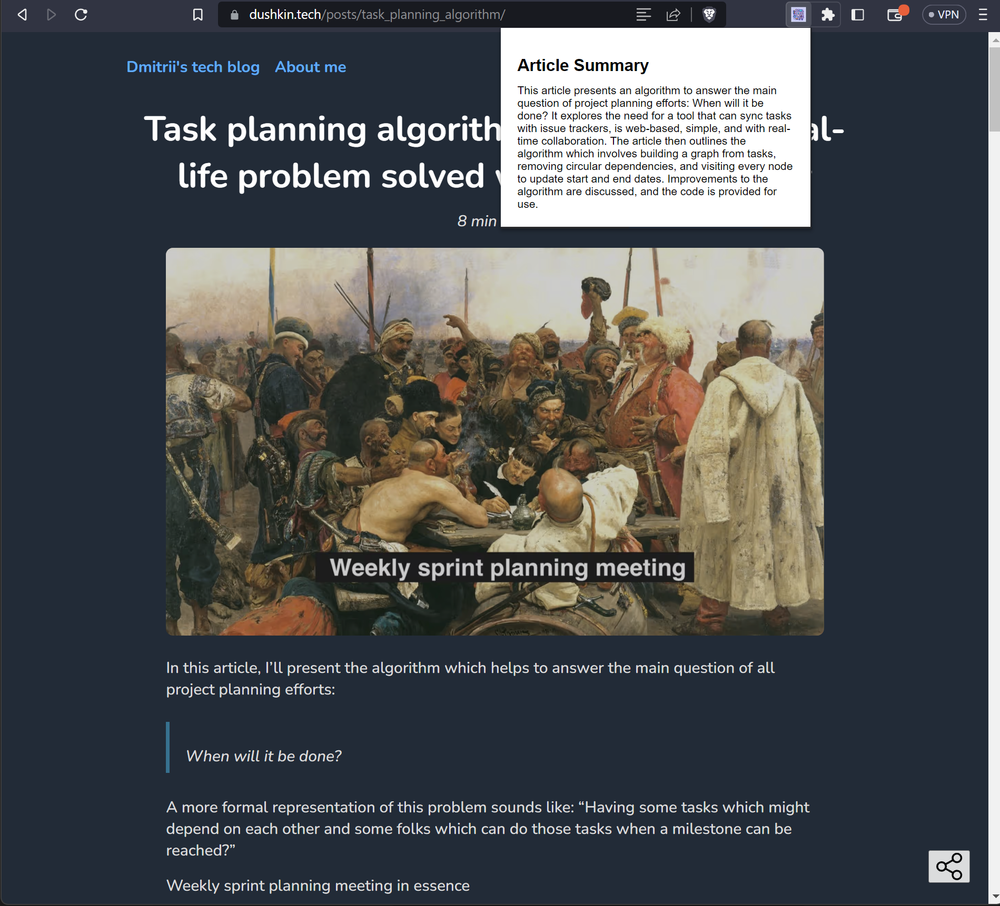

Experiment with ChatGPT as a development driver of a Chrome Extension that generates summaries for article on the current webpage.

Test the extension:

1. Load it to browser

   - Generate and add OpenAI API key to src/keys.js
   - Open Chrome and navigate to chrome://extensions/
   - Enable "Developer mode" in the top right corner
   - Click "Load unpacked" and select the directory containing your extension files
   - The extension should now appear in your browser, and you can test it on various web pages

2. Try:

   - Open page with article
   - Click on extension's button

